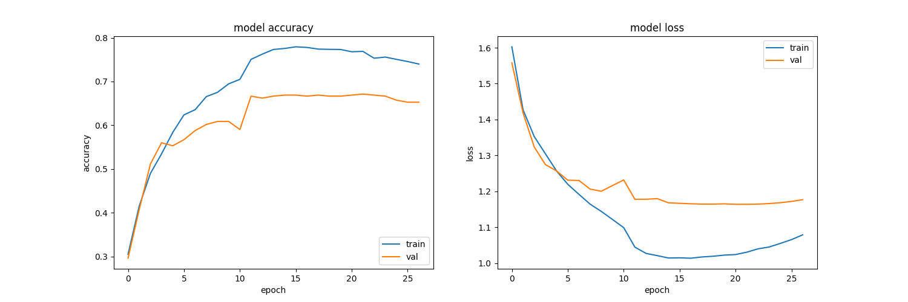

## Image Classification using Vision Transformer

### Introduction
The Vision Transformer, or **ViT**, is a model for image classification that employs a Transformer-like architecture over patches of the image. An image is split into fixed-size patches, each of them are then linearly embedded, position embeddings are added, and the resulting sequence of vectors is fed to a standard Transformer encoder. To perform classification, the standard approach of adding an extra learnable “classification token” to the sequence is used. 

Here is the ViT architecture
<p align='middle'></p>
and its mechanism
<p align='middle'></p>

### Dataset
* The dataset is downloaded from [Kaggle](https://www.kaggle.com/datasets/alxmamaev/flowers-recognition). It contains 4242 images of flowers, and is divided into five classes: *chamomile*, *tulip*, *rose*, *sunflower*, and *dandelion*.
* For each class there are about 800 photos. Photos are not high resolution, about 320x240 pixels. Photos are not reduced to a single size, they have different proportions.

### How to use
* Step 1: Automatically install all dependencies from `requirements.txt`.
    ```
    pip install -r requirements.txt
    ```
* Step 2: Configure hyper-parameters in `config.py` and train model.
    ```
    python train.py
    ```
* Step 3: Evaluate model.
    ```
    python evaluate.py
    ```

### Results


### References
[Dosovitskiy et al. "An Image is Worth 16x16 Words: Transformers for Image Recognition at Scale". In ICLR, 2021.](https://arxiv.org/abs/2010.11929)